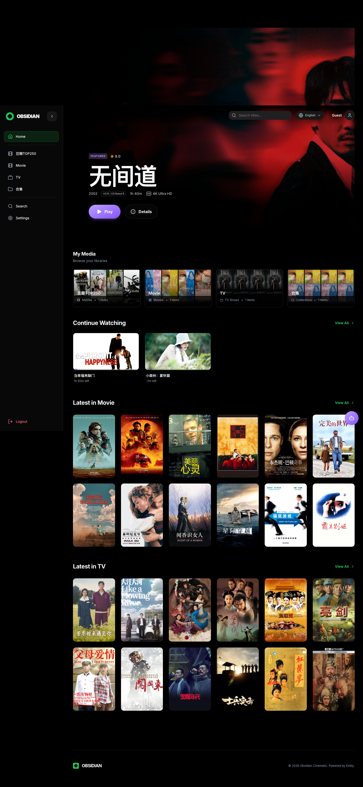
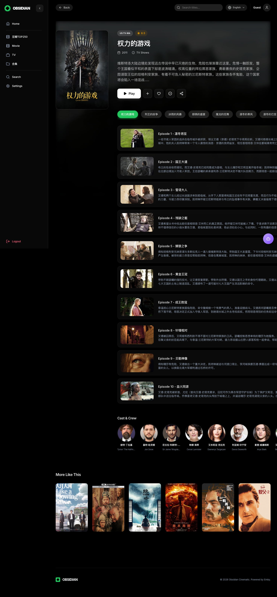
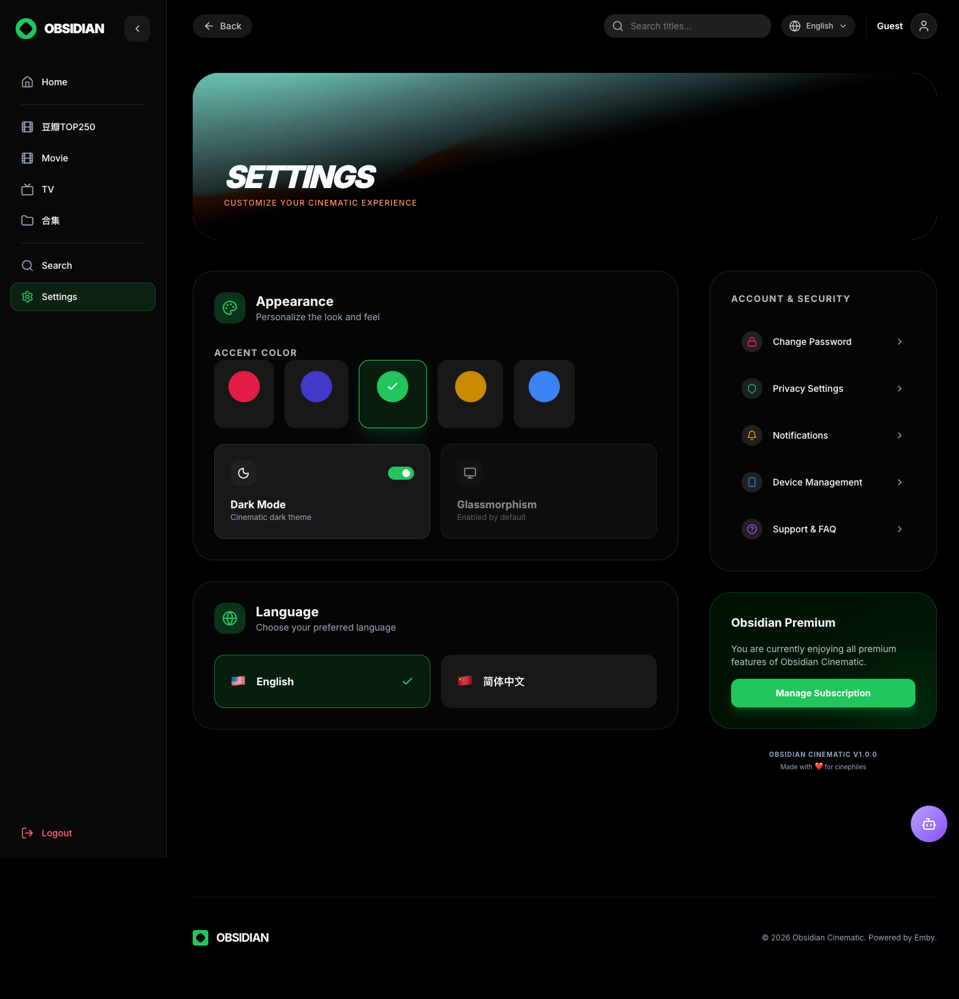

# Obsidian Media Player

[](https://github.com/ViperJooy/obsidian/actions/workflows/build.yml)

[English](README.md) | [中文](README.zh-CN.md)

一款基于 React 19、TypeScript 和 Vite 构建的现代化 Emby 客户端。旨在为你个人的媒体库提供极具沉浸感和电影级的观看体验。

---

## Demo







---

## 核心特性

- **电影级 UI**：基于 Tailwind CSS v4 打造的极致毛玻璃（Glassmorphism）视觉效果。
- **全方位播放支持**：内置原生 HTML5 播放与基于 `hls.js` 的 HLS 转码流播放。
- **智能进度同步**：与 Emby 服务器实时双向同步播放进度，随时随地"继续观看"。
- **完善的国际化**：全面支持中英双语无缝切换。
- **动态主题系统**：无缝的浅色/深色模式，并支持自定义强调色（皇家紫、琥珀金、祖母绿、玫瑰粉）。
- **沉浸式媒体信息**：浏览电影、电视剧、单集列表、演职人员及相似推荐。
- **快捷键控制**：空格播放/暂停、方向键快进快退调音量、M 静音、F 全屏等。

## 技术栈

| 分类 | 技术 |
|------|------|
| 框架 | [React 19](https://react.dev/) + [TypeScript](https://www.typescriptlang.org/) |
| 构建工具 | [Vite](https://vitejs.dev/) |
| 样式 | [Tailwind CSS v4](https://tailwindcss.com/) |
| 动画 | [Motion (Framer Motion)](https://motion.dev/) |
| 路由 | [React Router v7](https://reactrouter.com/) |
| 多语言 | [react-i18next](https://react.i18next.com/) |
| 播放器核心 | 原生 HTML5 Video + [hls.js](https://github.com/video-dev/hls.js/) |

## GitHub Actions 自动化打包

本项目内置了 GitHub Actions 自动化构建工具 (`.github/workflows/build.yml`)。你可以直接在 GitHub 项目设置中配置 Emby 服务器地址。

**配置指南：**

1. 进入 GitHub 仓库 → 顶部 **Settings** → 左侧 **Secrets and variables** → **Actions** → **Variables** 标签页。
2. 点击 **New repository variable** 添加新变量：
   - Name: `VITE_EMBY_SERVER_URL`
   - Value: `你的 Emby 服务器地址 (例如 https://emby.xxx.com)`
3. 每次推送到 `main` 分支会自动触发构建，在 **Actions** 页面下载构建产物。
4. 也可在 **Actions** 页面手动触发构建，临时指定 Emby 服务器 URL。

## 本地开发

```bash
# 克隆项目
git clone git@github.com:ViperJooy/obsidian.git
cd obsidian

# 安装依赖
npm install

# 配置 Emby 服务
# 复制 .env.example 并重命名为 .env，填写你的 Emby 服务器地址

# 启动开发环境
npm run dev
```

## 开源协议

MIT
